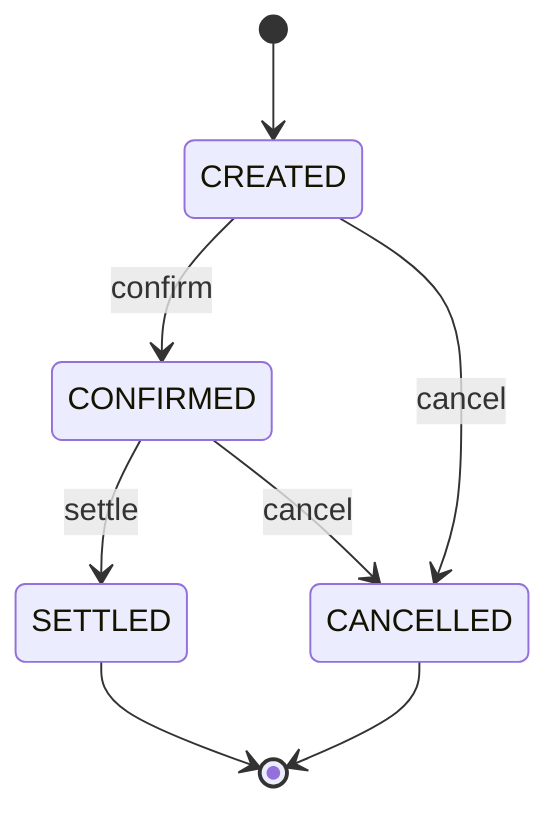

# fx-ops


Microsserviço de operações de câmbio (FX) construído como estudo de
arquitetura backend: domínio rico, máquina de estados, idempotência,
tratamento de erros padronizado e autenticação stateless.

## Domínio

Uma `Operation` representa uma operação de câmbio (par de moedas, valor,
taxa, lado comprador ou vendedor) e agrega as partes envolvidas (`Party`).
O ciclo de vida é controlado por uma máquina de estados:



## Stack

| Camada        | Tecnologia                                 |
|---------------|--------------------------------------------|
| Linguagem     | Java 21 (Temurin)                          |
| Framework     | Spring Boot 3.5 (Web, Validation)          |
| Persistência  | Spring Data JPA + Hibernate, H2 em memória |
| Build         | Maven (wrapper incluso)                    |

## Arquitetura

Separação por camadas, com o domínio independente de framework web:

```
src/main/java/com/iab/fxops
├── domain            # entidades, enums e regras de negócio
├── application       # casos de uso
├── infrastructure
│   ├── persistence   # repositories (Spring Data)
│   ├── web           # controllers e DTOs
│   └── security      # autenticação JWT
└── config            # beans de configuração e seed
```

## Como rodar

Pré-requisito: JDK 21.

```bash
./mvnw spring-boot:run
```

A aplicação sobe em `http://localhost:8080`, com seed de dados inicial.

Console do H2 disponível em `/h2-console`
(JDBC URL `jdbc:h2:mem:fxops`, usuário `sa`, senha vazia).

## Endpoints

| Método | Rota                        | Descrição                            | Status      |
|--------|-----------------------------|--------------------------------------|-------------|
| GET    | `/health`                   | Health check                         | disponível  |
| POST   | `/auth/login`               | Autenticação, retorna JWT            | planejado   |
| POST   | `/operations`               | Cria operação (com Idempotency-Key)  | planejado   |
| GET    | `/operations?page=&size=`   | Lista paginada                       | planejado   |
| GET    | `/operations/{id}`          | Detalhe com partes                   | planejado   |
| POST   | `/operations/{id}/confirm`  | Confirma operação                    | planejado   |
| POST   | `/operations/{id}/settle`   | Liquida operação                     | planejado   |
| POST   | `/operations/{id}/cancel`   | Cancela operação                     | planejado   |

## Roadmap

- [x] Setup, configuração e health check
- [x] Domínio JPA com relacionamento one-to-many e seed
- [x] Otimização de fetch (problema N+1, EntityGraph)
- [ ] Camada de use cases
- [ ] Máquina de estados no domínio
- [ ] API REST com DTOs e validação
- [ ] Idempotência na criação de operações
- [ ] Tratamento global de erros (Problem Details, RFC 7807)
- [ ] Autenticação JWT com Spring Security
- [ ] Testes unitários e de integração
- [ ] Documentação OpenAPI (Swagger) e Actuator
